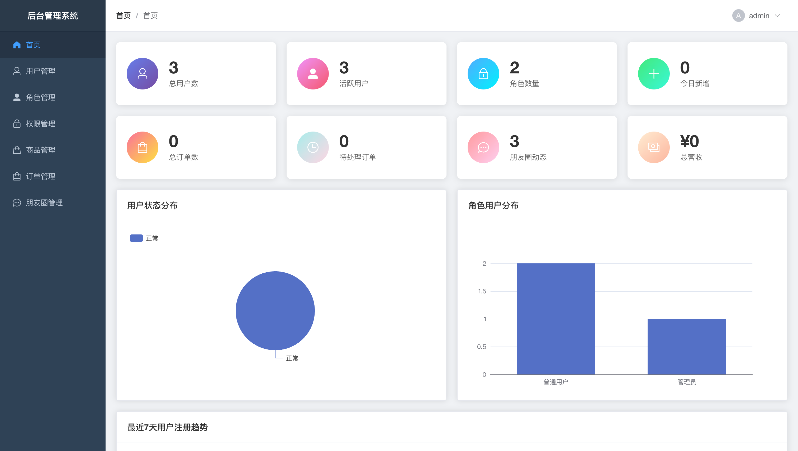
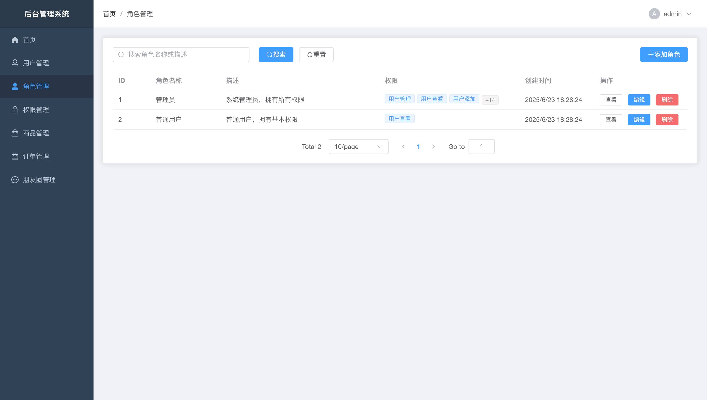
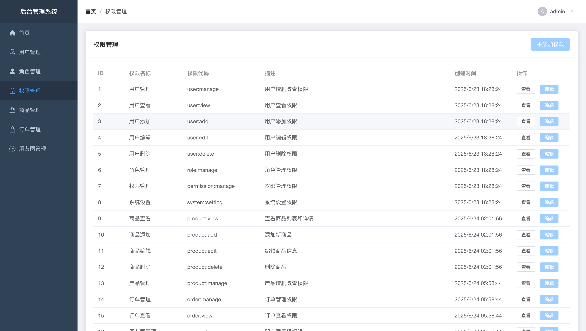
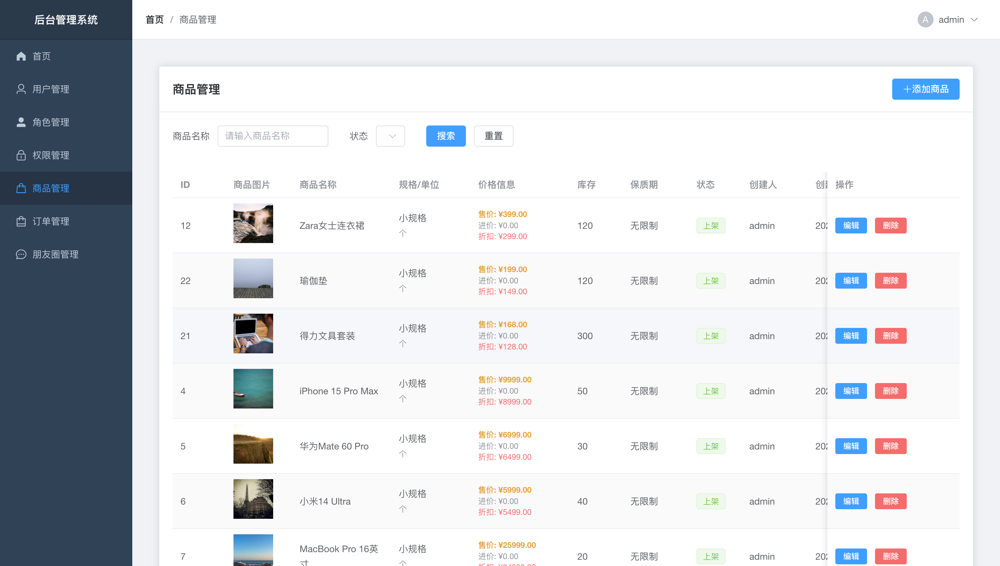
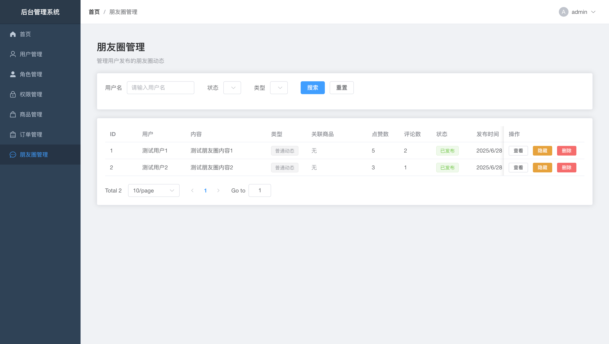
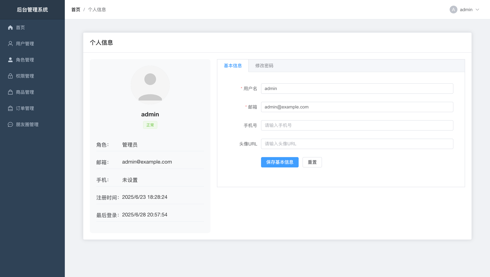
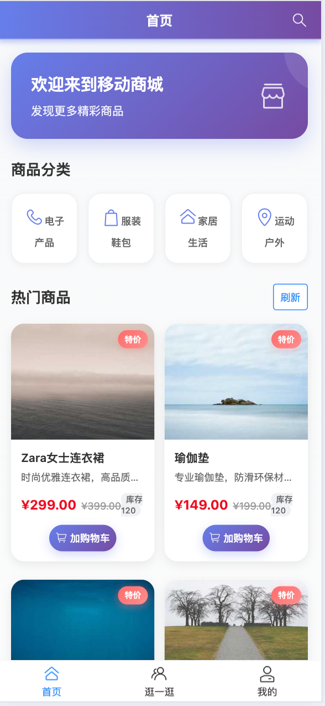
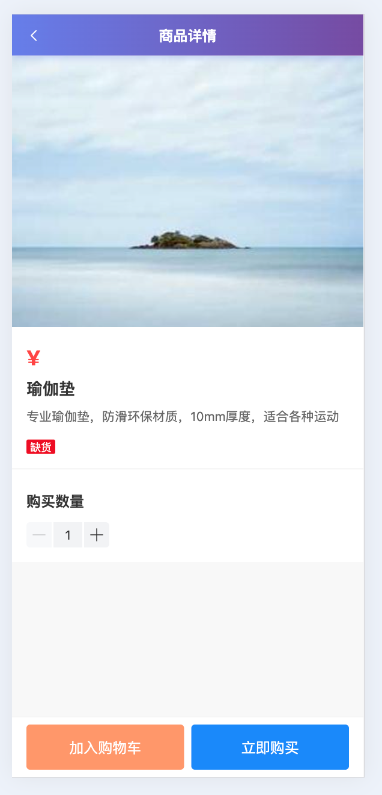
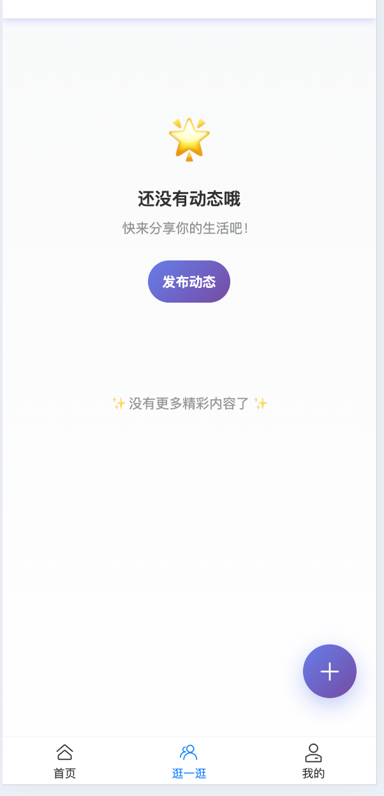
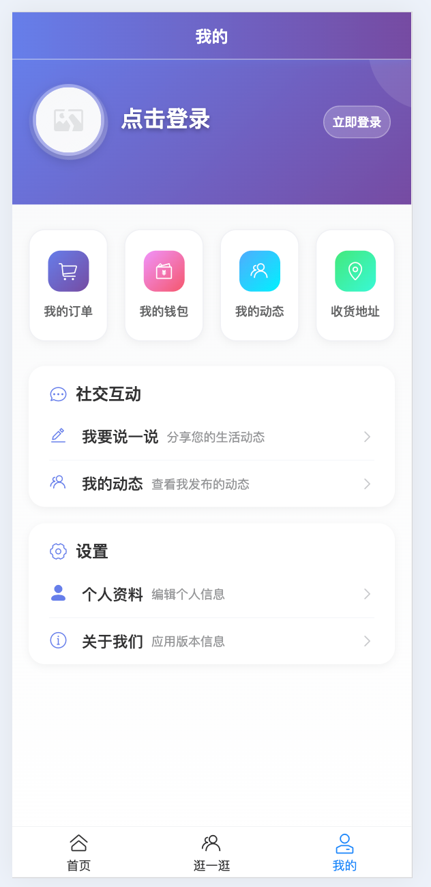

# EMSP - 电商与朋友圈社交平台

一个基于现代化技术栈构建的全栈电商与社交平台，包含管理后台、移动端商城和微服务架构后端。

## 🎯 项目概述

EMSP (E-commerce & Moments Social Platform) 是一个功能完整的电商与社交平台，提供：

- **管理后台**: 基于 Vue3 + Element Plus 的现代化管理界面
- **移动端商城**: 基于 Vue3 + Vant4 的移动端购物应用
- **Node.js 后端**: 基于 Koa2 的单体后端服务
- **微服务后端**: 基于 Spring Boot + Spring Cloud 的微服务架构（开发中）

## 🚀 核心功能

### 📱 移动端商城

- **商品浏览**: 商品列表、搜索、详情、分类筛选
- **购物车**: 添加商品、数量管理、批量操作
- **订单管理**: 下单、支付、订单状态跟踪、评价
- **朋友圈**: 发布动态、图片分享、点赞评论、社交互动
- **个人中心**: 用户信息、钱包余额、地址管理
- **支付系统**: 钱包支付、支付宝、微信支付

### 💻 管理后台

- **用户管理**: 用户列表、添加编辑、状态管理、权限分配
- **商品管理**: 商品 CRUD、库存管理、价格设置、状态控制
- **订单管理**: 订单列表、状态更新、搜索筛选、统计分析
- **朋友圈管理**: 内容审核、评论管理、违规处理
- **角色权限**: RBAC 权限系统、动态菜单、按钮级权限
- **数据统计**: 实时数据看板、图表展示、业务指标

### 🔐 认证授权

- **JWT 认证**: 无状态身份验证
- **权限控制**: 基于角色的访问控制 (RBAC)
- **安全防护**: 密码加密、接口鉴权、跨域处理

## 🛠️ 技术栈

### 前端技术

| 项目         | 技术栈                                           |
| ------------ | ------------------------------------------------ |
| **管理后台** | Vue 3 + Element Plus + Vue Router + Pinia + Vite |
| **移动端**   | Vue 3 + Vant 4 + Vue Router + Pinia + Vite       |
| **共同依赖** | Axios + ECharts + Day.js                         |

### 后端技术

| 项目             | 技术栈                                       |
| ---------------- | -------------------------------------------- |
| **Node.js 后端** | Koa 2 + MySQL + JWT + bcrypt + Joi           |
| **微服务后端**   | Spring Boot + Spring Cloud + Nacos + Gateway |
| **数据库**       | MySQL 8.0 + Redis 6.x                        |

## 📁 项目结构

```
emsp/
├── frontend/                    # Vue3 管理后台
│   ├── src/
│   │   ├── views/              # 页面组件
│   │   │   ├── users/          # 用户管理
│   │   │   ├── products/       # 商品管理
│   │   │   ├── orders/         # 订单管理
│   │   │   ├── moments/        # 朋友圈管理
│   │   │   ├── roles/          # 角色管理
│   │   │   └── permissions/    # 权限管理
│   │   ├── router/             # 路由配置
│   │   ├── stores/             # 状态管理
│   │   └── utils/              # 工具函数
│   └── package.json
│
├── mobile/                      # Vue3 移动端商城
│   ├── src/
│   │   ├── views/              # 页面组件
│   │   │   ├── Home.vue        # 商品首页
│   │   │   ├── Moments.vue     # 朋友圈
│   │   │   ├── Profile.vue     # 个人中心
│   │   │   ├── Cart.vue        # 购物车
│   │   │   ├── Orders.vue      # 订单列表
│   │   │   └── Payment.vue     # 支付页面
│   │   ├── components/         # 公共组件
│   │   ├── stores/             # 状态管理
│   │   └── utils/              # 工具函数
│   └── package.json
│
├── backend/                     # Koa2 后端服务
│   ├── src/
│   │   ├── controllers/        # 控制器
│   │   │   ├── authController.js       # 认证
│   │   │   ├── userController.js       # 用户管理
│   │   │   ├── productController.js    # 商品管理
│   │   │   ├── mobileController.js     # 移动端API
│   │   │   ├── momentController.js     # 朋友圈
│   │   │   └── dashboardController.js  # 数据统计
│   │   ├── middleware/         # 中间件
│   │   ├── routes/             # 路由定义
│   │   └── utils/              # 工具类
│   └── package.json
│
├── emsp-microservices/          # Spring Boot 微服务
│   ├── gateway/                # API 网关
│   ├── auth-service/           # 认证服务
│   ├── user-service/           # 用户服务
│   ├── product-service/        # 商品服务
│   ├── order-service/          # 订单服务
│   ├── moment-service/         # 朋友圈服务
│   └── common/                 # 公共模块
│
├── database/                    # 数据库脚本
│   ├── init.sql                # 基础表结构
│   ├── mobile-app.sql          # 移动端相关表
│   ├── products.sql            # 商品数据
│   └── product-permissions.sql # 权限数据
│
├── start.sh                     # 一键启动脚本
├── start-mobile.sh             # 移动端启动脚本
└── README.md                   # 项目说明
```

## 🗄️ 数据库设计

### 核心表结构

#### 用户系统

- `users` - 用户基本信息
- `roles` - 角色定义
- `permissions` - 权限定义
- `role_permissions` - 角色权限关联
- `user_addresses` - 用户地址

#### 商品系统

- `products` - 商品信息
- `product_specs` - 商品规格
- `product_units` - 商品单位
- `shopping_cart` - 购物车

#### 订单系统

- `orders` - 订单主表
- `order_items` - 订单商品明细
- `user_wallets` - 用户钱包
- `wallet_transactions` - 钱包流水

#### 社交系统

- `moments` - 朋友圈动态
- `moment_comments` - 评论
- `moment_likes` - 点赞记录

## ⚡ 快速开始

### 环境要求

- Node.js 16+
- MySQL 8.0+
- Redis 6.x (可选)

### 1. 克隆项目

```bash
git clone <repository-url>
cd emsp
```

### 2. 数据库初始化

```bash
# 创建数据库
mysql -u root -p -e "CREATE DATABASE emsp CHARACTER SET utf8mb4 COLLATE utf8mb4_unicode_ci;"

# 导入数据库结构和数据
mysql -u root -p emsp < database/init.sql
mysql -u root -p emsp < database/mobile-app.sql
mysql -u root -p emsp < database/products.sql
mysql -u root -p emsp < database/product-permissions.sql
```

### 3. 配置后端

```bash
cd backend
cp config.example.js config.js
# 编辑 config.js 配置数据库连接信息
npm install
```

### 4. 一键启动

```bash
# 启动管理后台 + 后端
chmod +x start.sh
./start.sh

# 启动移动端
chmod +x start-mobile.sh
./start-mobile.sh
```

### 5. 访问应用

- **管理后台**: http://localhost:8081
- **移动端商城**: http://localhost:3001
- **后端 API**: http://localhost:3000

### 6. 默认账号

- **管理员**: admin / admin123
- **普通用户**: testuser / user123

## 🔌 API 接口

### 认证接口

- `POST /api/auth/login` - 用户登录
- `POST /api/auth/register` - 用户注册
- `GET /api/auth/current` - 获取当前用户

### 管理后台接口

- `GET /api/users` - 用户管理
- `GET /api/products` - 商品管理
- `GET /api/orders` - 订单管理
- `GET /api/moments` - 朋友圈管理
- `GET /api/dashboard/stats` - 数据统计

### 移动端接口

- `GET /api/mobile/products` - 商品列表
- `POST /api/mobile/cart` - 购物车操作
- `POST /api/mobile/orders` - 订单管理
- `GET /api/mobile/wallet` - 钱包相关

## 📊 业务流程

### 购物流程

1. 用户浏览商品 → 加入购物车 → 结算下单 → 选择支付方式 → 完成支付 → 订单完成

### 社交流程

1. 用户发布动态 → 朋友圈展示 → 其他用户浏览 → 点赞评论 → 社交互动

### 管理流程

1. 管理员登录 → 商品管理 → 订单处理 → 用户管理 → 内容审核 → 数据分析

## 🎨 界面展示

### 📱 移动端商城界面

#### 商品首页 & 详情页

<p align="center">
  
  
</p>

#### 购物车 & 订单管理

<p align="center">
  
  
</p>

#### 朋友圈 & 个人中心

<p align="center">
  
  
</p>

#### 支付 & 钱包

<p align="center">
  
  
</p>

### 💻 管理后台界面

#### 数据统计看板

<p align="center">
  
</p>

#### 用户管理

<p align="center">
  
</p>

#### 订单管理 & 朋友圈管理

<p align="center">
  
</p>

### 界面特色

#### 管理后台特色

- 现代化 UI 设计，基于 Element Plus
- 响应式布局，支持多设备访问
- 数据可视化图表，直观展示业务数据
- 权限控制，不同角色看到不同功能

#### 移动端特色

- 原生 App 体验，流畅的交互动画
- 完美适配移动设备，支持触摸操作
- 类微信朋友圈设计，用户体验友好
- 现代化支付界面，支持多种支付方式

## 🔧 部署说明

### 开发环境

```bash
# 后端
cd backend && npm run dev

# 管理前端
cd frontend && npm run dev

# 移动前端
cd mobile && npm run dev
```

### 生产环境

```bash
# 构建前端
cd frontend && npm run build
cd mobile && npm run build

# 启动后端
cd backend && npm start
```

### Docker 部署

```bash
# 使用 Docker Compose 一键部署
docker-compose up -d
```

## 📈 功能路线图

- [x] 基础用户管理系统
- [x] 商品管理和展示
- [x] 购物车和订单系统
- [x] 朋友圈社交功能
- [x] 钱包支付系统
- [x] 权限管理系统
- [ ] 微服务架构完善
- [ ] 消息推送系统
- [ ] 数据分析报表
- [ ] 第三方支付集成
- [ ] 移动端 App 开发

## 🤝 贡献指南

1. Fork 项目
2. 创建功能分支
3. 提交更改
4. 推送到分支
5. 创建 Pull Request

## 📄 许可证

MIT License

## 📞 联系方式

如有问题或建议，请提交 Issue 或联系开发团队。

---

**注意**: 本项目仅供学习和参考使用，请勿用于商业用途。
